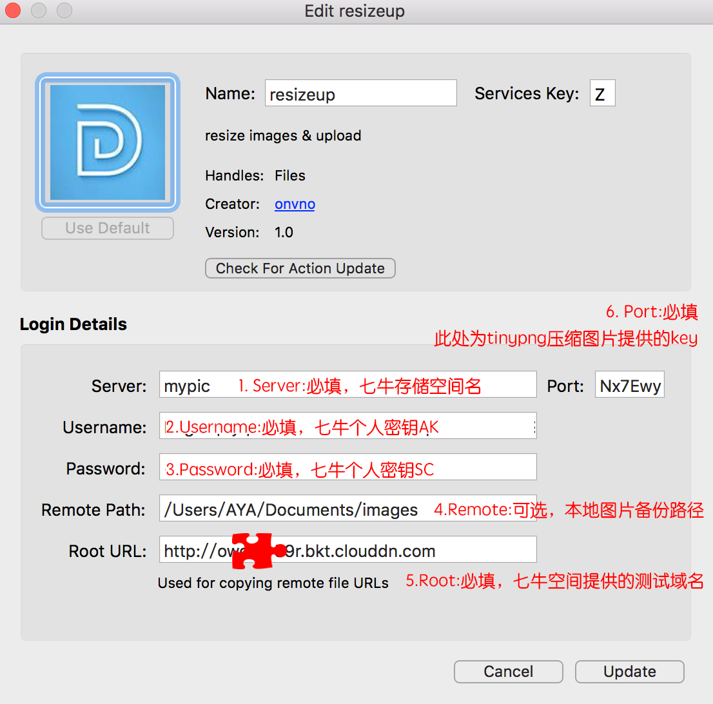
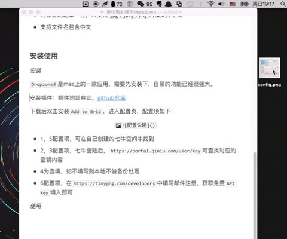

# resizeup
Dropzone3's action plugin - markdown insert images solution


#### 优雅使用Markdown

日常开发，程序员记录`markdown`必然是首选项。一切都好，唯独图片是个恼人的事情。存在本地，迁移文档时候路径就容易出问题，没法正常显示。上传图床，又靠谱又方便的实在是屈指可数。想来搞搞这个问题，也是偶然。

清理Mac桌面时，了解到Dropzone3这款应用，可以方便开发`action`插件，有国内开发者创建了一键上传七牛的`action`。安装插件使用后，本地环境没法正常启动，而作者已经不再更新。了解下`Dropzone3`，在作者插件基础上，根据自己功能需求，完成了一个相对使用度比较高的`action`:`resizeup`。

`resizeup`使用应该算是极简了，第一次使用配置后，之后只需拖拽图片，然后`ctrl + v`粘贴图片链接即可，我想这基本上是最简单的方案了吧


#### 实现功能

`resizeup`是为写字爱好者提供更好的图床解决方案，方便快速高效的在`markdown`中添加图片。

使用了口碑不错的`qiniu`提供的免费服务，前端之友`tinypng`提供的免费压缩图片接口。考虑到个人博客小规模使用，`qiniu`免费的10G空间，20G流量，`tinypng`每月免费`500张`图片压缩，足够我们正常使用。

* **图片拖拽上传七牛云存储**：速度存储口碑都不错；
* **文件增加md5验证**：为避免图片重复上传及重名文件被替换，计算了文件md5值，上传文件名由 文件名 + MD5组成；
* **图片压缩**：虽说七牛免费空间还能经得起一时折腾，但考虑到长期使用，在不影响正常阅览情况下，还是得精打细算，毕竟码农家也没有余粮；
* **本地备份**：可选，此功能是在参考链接的插件中，功能直接迁移来的。

其他说明：

* 为保证功能单一性，只支持`jpg`,`jpeg`,`png`后缀文件上传
* 支持文件名包含中文


#### 安装使用

**安装**

* 安装`Dropzone3`

  `Dropzone3`是mac上的一款小强应用，桌面效率工具，[官网下载地址](https://aptonic.com/dropzone3/latest)

  `resizeup`是`Dropzone3`的一个插件。

* 安装`resizeup`：

```
方法一：云盘下载解压，获取.dzbundle文件
云盘链接:https://pan.baidu.com/s/1nu8TNLn 密码: bb4e

方法二：下载本仓库，.dzbundle文件即为本插件
仓库地址:https://github.com/onvno/resizeup
```

* 配置`resizeup`

  下载后,双击`.dzbundle文件`安装选择`Add to Grid`，进入配置页，配置项如下：



* 1，5配置项，可在自己创建的七牛空间中找到
* 2，3配置项，七牛登陆后，`https://portal.qiniu.com/user/key`可查找对应的密钥内容
* 4为选填，如不填写则本地不做备份处理
* 6配置项，在`https://tinypng.com/developers`中填写邮件注册，获取免费`API key`填入即可

**安装注意事项**
安装中遇到问题可参考[issue](https://github.com/onvno/resizeup/issues/2)


**使用**

拖拽到插件位置，等待返回信息，直接`ctrl + v`使用：




#### 参考

* [使用Dropzone和七牛优化博客图床](http://yansu.org/2015/01/10/use-dropzone-and-qiniu-to-store-blog-images.html)
* [Dropzone 3 Actions](https://github.com/aptonic/dropzone3-actions/blob/master/README.md#dzalerttitle-message):Dropzone开发文档
